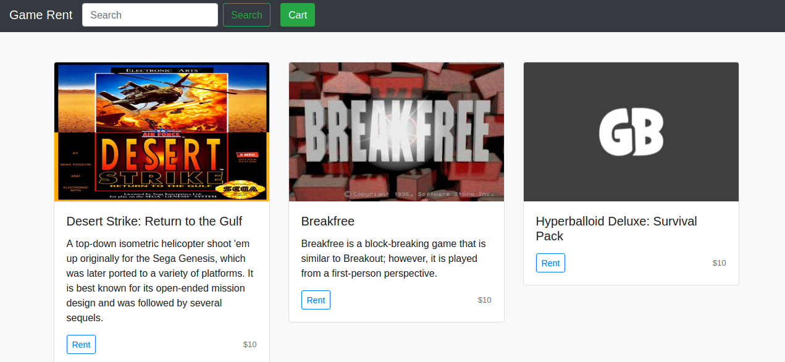
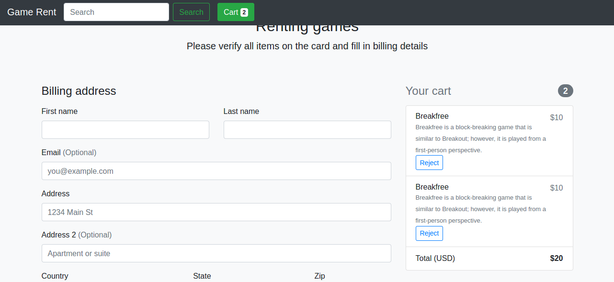
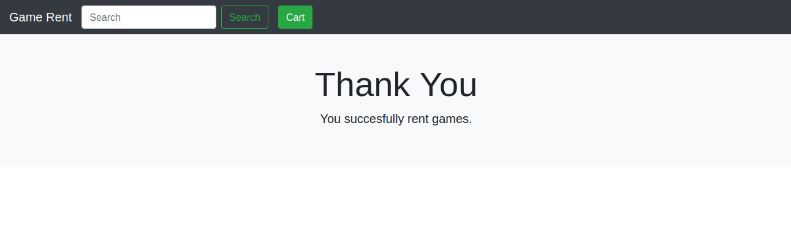

# shop

Example shop for renting games





## Developing

### Setup

When you first clone this repository, run:

```sh
lein duct setup
```

This will create files for local configuration, and prep your system
for the project.

### Environment

To begin developing, start with a REPL.

```sh
lein repl
```

Then load the development environment.

```clojure
user=> (dev)
:loaded
```

Run `go` to prep and initiate the system.

```clojure
dev=> (go)
:duct.server.http.jetty/starting-server {:port 3000}
:initiated
```

By default this creates a web server at <http://localhost:3000>.

When you make changes to your source files, use `reset` to reload any
modified files and reset the server.

```clojure
dev=> (reset)
:reloading (...)
:resumed
```

## Legal

Copyright © 2020 FIXME
